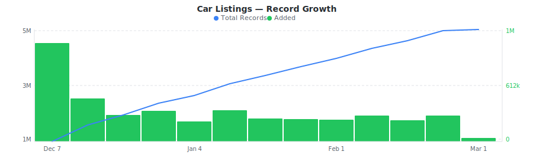

# CarGurus.com US Vehicle Listings Dataset

&nbsp;&nbsp;[](https://rebrowser.net/products/datasets/carguruscom)

Daily sample of U.S. used car listings from CarGurus.com with deal ratings, vehicle specs, mileage, dealer info, and market positioning data.


This repository contains a preview sample of the [CarGurus.com (US) dataset](https://rebrowser.net/products/datasets/carguruscom) published by Rebrowser. If you're doing academic research, you may be eligible for free access to a much larger slice — see [Free Datasets for Research](https://rebrowser.net/free-datasets-for-research).


This dataset contains **1** entity, each in its own folder: Car Listings (`car-listings`). See below for a full field breakdown, sample counts, and data distributions for each.

*Found this useful? ⭐ Star this repo to help us keep publishing fresh data. Found an error? [Let us know](https://rebrowser.net/contact-us).*


---

### Car Listings
Sample of U.S. CarGurus.com vehicle listings with deal ratings, specs, mileage, dealer ratings, and seller locations.


> **4,380,834** total records from 2025-12-07 to 2026-02-15, **up to 30,000** rows in this sample (0.68% of full dataset).
> Exported as one file per day, up to 1,000 rows each, last undefined days retained.



| Field | Type | Fill Rate | Description |
| --- | --- | --- | --- |
| `_primaryKey` | `string` | 100% | Unique identifier for this record |
| `_firstSeenAt` | `datetime` | 100% | First time this record was seen |
| `_lastSeenAt` | `datetime` | 100% | Last time this record was updated |
| `listingId` | `string` | 100% | CarGurus.com listing ID (unique identifier) |
| `vin` 🔒 | `string` | 100% | Vehicle Identification Number (17-character unique code) |
| `price` 🔒 | `float` | 87% | Listed price in USD |
| `expectedPrice` 🔒 | `float` | 92% | Expected/fair market price in USD |
| `priceDifferential` | `float` | 81% | Difference between listed and expected price (positive = overpriced) |
| `dealScore` 🔒 | `float` | 80% | CarGurus.com deal score (lower = better deal) |
| `dealRatingKey` | `string` | 100% | Deal rating (GREAT_PRICE, GOOD_PRICE, FAIR_PRICE, POOR_PRICE, OVERPRICED, OUTLIER, NA) |
| `mileage` | `float` | 98% | Odometer reading in miles |
| `vehicleCondition` | `string` | 100% | Vehicle condition (USED, CPO, NEW) |
| `stockNumber` | `string` | 98% | Dealer stock number |
| `year` | `float` | 100% | Vehicle model year |
| `make` | `string` | 100% | Vehicle manufacturer (e.g., Toyota, Ford) |
| `model` | `string` | 100% | Vehicle model (e.g., Camry, F-150) |
| `trim` | `string` | 98% | Vehicle trim level (e.g., LX, Limited) |
| `bodyStyle` | `string` | 100% | Body style (sedan, pickup_truck, suv, crossover, hatchback, coupe, minivan, wagon, convertible, van) |
| `exteriorColor` | `string` | 96% | Exterior color |
| `interiorColor` | `string` | 85% | Interior color |
| `transmission` | `string` | 98% | Transmission type (e.g., 8-Speed Automatic, Continuously Variable Transmission) |
| `drivetrain` | `string` | 97% | Drivetrain (Four-Wheel Drive, Front-Wheel Drive, Rear-Wheel Drive, All-Wheel Drive, 4X2) |
| `engine` | `string` | 99% | Engine description (e.g., 420 hp 3L I6) |
| `fuelType` | `string` | 99% | Fuel type (Gasoline, Diesel, Biodiesel, Flex Fuel Vehicle, Hybrid, Electric) |
| `fuelTankCapacity` | `float` | 95% | Fuel tank capacity in gallons |
| `mpgCity` | `float` | 83% | City fuel economy in MPG |
| `mpgHighway` | `float` | 83% | Highway fuel economy in MPG |
| `mpgCombined` | `float` | 83% | Combined fuel economy in MPG |
| `numberOfDoors` | `string` | 97% | Number of doors (2 doors, 3 doors, 4 doors) |
| `description` | `string` | 96% | Full listing description text |
| `options` | `array` | 98% | Array of vehicle options/features |
| `images` 🔒 | `array` | 82% | Array of highest resolution image URLs |
| `imagesCount` | `float` | 82% | Number of listing images |
| `daysAtDealer` | `float` | 100% | Days vehicle has been at dealer |
| `daysOnMarket` | `float` | 100% | Days listing has been on market |
| `accidentCount` | `float` | 92% | Number of accidents in vehicle history (0-5) |
| `ownerCount` | `float` | 90% | Number of previous owners (1-5) |
| `hasVehicleHistoryReport` | `bool` | 92% | Whether vehicle history report is available |
| `optionsCount` | `float` | 98% | Number of options/features listed |
| `highLeverage` | `bool` | 25% | Whether listing is flagged as high leverage |
| `isNationwideShipper` | `bool` | 20% | Whether dealer ships nationwide |
| `entityId` | `string` | 100% | CarGurus.com entity/trim ID (e.g., t113477) |
| `carId` | `float` | 100% | CarGurus.com car ID |
| `makeId` | `string` | 100% | CarGurus.com make ID (e.g., m32) |
| `modelId` | `string` | 100% | CarGurus.com model ID (e.g., d493) |
| `postalCode` | `string` | 100% | Listing postal code |
| `sellerId` | `float` | 100% | CarGurus.com seller/dealer ID |
| `sellerType` | `string` | 100% | Seller type (e.g., DEALER) |
| `sellerName` 🔒 | `string` | 100% | Dealer/seller name |
| `sellerStreet` 🔒 | `string` | 99% | Seller street address |
| `sellerCity` | `string` | 99% | Seller city |
| `sellerState` | `string` | 99% | Seller state (2-letter code) |
| `sellerPostalCode` | `string` | 99% | Seller postal code |
| `sellerCountry` | `string` | 99% | Seller country (e.g., US) |
| `sellerLatitude` 🔒 | `float` | 99% | Seller location latitude |
| `sellerLongitude` 🔒 | `float` | 99% | Seller location longitude |
| `sellerPhone` 🔒 | `string` | 88% | Seller phone number |
| `sellerPhoneSMS` 🔒 | `string` | 85% | Seller SMS phone number |
| `sellerWebsite` 🔒 | `string` | 100% | Seller website domain |
| `isFranchiseDealer` | `bool` | 61% | Whether seller is a franchise dealer |
| `sellerSalesStatus` | `string` | 100% | Seller sales status (PAYING, AVAILABLE) |
| `sellerRating` | `float` | 95% | Seller average rating |
| `sellerReviewCount` | `float` | 95% | Number of seller reviews |
| `listingUrl` 🔒 | `string` | 100% | Full URL to the CarGurus.com listing page |


> 🔒 **Premium fields** are included in the data files but their values are replaced with `[PREMIUM]`. To access real values, [use our website](https://rebrowser.net/products/datasets/carguruscom).


#### Field Distributions


<details>
<summary><strong>Deal Rating Distribution</strong> (<code>dealRatingKey</code>)</summary>


| Value | Count | Share |
| --- | --- | --- |
| FAIR_PRICE | 1,363,018 | `██████░░░░░░░░░░░░░░` 31.1% |
| GOOD_PRICE | 871,093 | `████░░░░░░░░░░░░░░░░` 19.9% |
| NA | 841,623 | `████░░░░░░░░░░░░░░░░` 19.2% |
| GREAT_PRICE | 486,025 | `██░░░░░░░░░░░░░░░░░░` 11.1% |
| POOR_PRICE | 467,276 | `██░░░░░░░░░░░░░░░░░░` 10.7% |
| OVERPRICED | 301,331 | `█░░░░░░░░░░░░░░░░░░░` 6.9% |
| OUTLIER | 50,468 | `░░░░░░░░░░░░░░░░░░░░` 1.2% |

</details>


<details>
<summary><strong>Body Style Distribution</strong> (<code>bodyStyle</code>)</summary>


| Value | Count | Share |
| --- | --- | --- |
| crossover | 1,491,369 | `███████░░░░░░░░░░░░░` 34.2% |
| sedan | 898,943 | `████░░░░░░░░░░░░░░░░` 20.6% |
| pickup_truck | 791,199 | `████░░░░░░░░░░░░░░░░` 18.1% |
| suv | 708,523 | `███░░░░░░░░░░░░░░░░░` 16.2% |
| coupe | 121,855 | `█░░░░░░░░░░░░░░░░░░░` 2.8% |
| hatchback | 91,478 | `░░░░░░░░░░░░░░░░░░░░` 2.1% |
| minivan | 87,437 | `░░░░░░░░░░░░░░░░░░░░` 2.0% |
| van | 69,813 | `░░░░░░░░░░░░░░░░░░░░` 1.6% |
| convertible | 55,388 | `░░░░░░░░░░░░░░░░░░░░` 1.3% |
| wagon | 49,305 | `░░░░░░░░░░░░░░░░░░░░` 1.1% |

</details>


<details>
<summary><strong>Fuel Type Distribution</strong> (<code>fuelType</code>)</summary>


| Value | Count | Share |
| --- | --- | --- |
| Gasoline | 3,692,984 | `█████████████████░░░` 85.3% |
| Hybrid | 214,805 | `█░░░░░░░░░░░░░░░░░░░` 5.0% |
| Flex Fuel Vehicle | 180,526 | `█░░░░░░░░░░░░░░░░░░░` 4.2% |
| Electric | 89,695 | `░░░░░░░░░░░░░░░░░░░░` 2.1% |
| Diesel | 79,327 | `░░░░░░░░░░░░░░░░░░░░` 1.8% |
| Biodiesel | 69,807 | `░░░░░░░░░░░░░░░░░░░░` 1.6% |
| Fuel Cell | 504 | `░░░░░░░░░░░░░░░░░░░░` 0.0% |
| Compressed Natural Gas | 180 | `░░░░░░░░░░░░░░░░░░░░` 0.0% |
| Propane | 6 | `░░░░░░░░░░░░░░░░░░░░` 0.0% |

</details>


<details>
<summary><strong>Vehicle Condition Distribution</strong> (<code>vehicleCondition</code>)</summary>


| Value | Count | Share |
| --- | --- | --- |
| USED | 4,055,503 | `███████████████████░` 92.6% |
| CPO | 325,225 | `█░░░░░░░░░░░░░░░░░░░` 7.4% |
| NEW | 106 | `░░░░░░░░░░░░░░░░░░░░` 0.0% |

</details>


<details>
<summary><strong>Top States by Listings</strong> (<code>sellerState</code>)</summary>


| Value | Count | Share |
| --- | --- | --- |
| TX | 447,750 | `████░░░░░░░░░░░░░░░░` 19.6% |
| CA | 386,757 | `███░░░░░░░░░░░░░░░░░` 16.9% |
| FL | 369,914 | `███░░░░░░░░░░░░░░░░░` 16.2% |
| IL | 180,451 | `██░░░░░░░░░░░░░░░░░░` 7.9% |
| NC | 164,540 | `█░░░░░░░░░░░░░░░░░░░` 7.2% |
| OH | 164,377 | `█░░░░░░░░░░░░░░░░░░░` 7.2% |
| GA | 160,246 | `█░░░░░░░░░░░░░░░░░░░` 7.0% |
| PA | 145,893 | `█░░░░░░░░░░░░░░░░░░░` 6.4% |
| NY | 134,631 | `█░░░░░░░░░░░░░░░░░░░` 5.9% |
| VA | 132,829 | `█░░░░░░░░░░░░░░░░░░░` 5.8% |

</details>


---

## Pre-built Views on Rebrowser

Rebrowser web viewer lets you filter, sort, and export any slice of this dataset interactively. These pre-built views are ready to open:


### Car Listings


[Great Deal Rated Listings](https://rebrowser.net/products/datasets/carguruscom/car-listings/views/great-deal-listings) — 468,501 records

↳ `[{"field":"dealRatingKey","op":"is","value":"GREAT_PRICE"},{"sort":"price ASC"}]`

[Used Vehicle Listings](https://rebrowser.net/products/datasets/carguruscom/car-listings/views/used-vehicle-listings) — 3,567,583 records

↳ `[{"field":"vehicleCondition","op":"is","value":"USED"},{"sort":"_lastSeenAt DESC"}]`

[Certified Pre-Owned Listings](https://rebrowser.net/products/datasets/carguruscom/car-listings/views/cpo-certified-listings) — 309,110 records

↳ `[{"field":"vehicleCondition","op":"is","value":"CPO"},{"sort":"_lastSeenAt DESC"}]`

[Listings with Vehicle History Reports](https://rebrowser.net/products/datasets/carguruscom/car-listings/views/listings-with-vehicle-history) — 3,611,295 records

↳ `[{"field":"hasVehicleHistoryReport","op":"isTrue"},{"sort":"_lastSeenAt DESC"}]`

[Nationwide Shipping Listings](https://rebrowser.net/products/datasets/carguruscom/car-listings/views/nationwide-shipping-listings) — 770,615 records

↳ `[{"field":"isNationwideShipper","op":"isTrue"},{"sort":"_lastSeenAt DESC"}]`


*[See all 35 views →](https://rebrowser.net/products/datasets/carguruscom/car-listings)*


---

## Code Examples

```python
import pandas as pd
from pathlib import Path

# ── Car Listings ───────────────────────────────────────────────────────────
files = sorted(Path('rebrowser/carguruscom-dataset/car-listings/data').glob('*.parquet'))[-7:]
df = pd.concat([pd.read_parquet(f) for f in files])

# Deal rating breakdown
print(df['dealRatingKey'].value_counts().to_string())

# Average mileage and days on market by body style
print(df.groupby('bodyStyle')[['mileage', 'daysOnMarket']].mean().round(0).to_string())

# Top 10 states by listing volume
print(df['sellerState'].value_counts().head(10).to_string())

# Electric vehicle listings by state
ev = df[df['fuelType'] == 'Electric']
print(ev['sellerState'].value_counts().head(10).to_string())

# Highest-rated dealers (min 50 reviews)
dealers = df[df['sellerReviewCount'] >= 50].drop_duplicates('sellerId')
print(dealers.nlargest(10, 'sellerRating')[['sellerId', 'sellerCity', 'sellerState', 'sellerRating', 'sellerReviewCount']]
      .to_string(index=False))
```

---

## Use Cases


### Pricing Benchmarks

Compare deal ratings and price differentials across makes, models, and regions to identify where vehicles are consistently over- or under-priced relative to market expectations.


### Inventory Analytics

Track body style and fuel type mix by state to understand regional demand patterns. Measure days-on-market by segment to spot slow-moving inventory.


### Dealer Performance

Rank dealers by review count and rating, then cross-reference with their listing volume and deal rating distribution to assess competitive positioning.


### EV Market Tracking

Filter for electric and hybrid listings to monitor EV penetration by state, compare mileage and pricing trends against gasoline equivalents, and track adoption over time.


---

## Full Dataset on Rebrowser


This repo is a 1,000-row preview sample. The full dataset is at [rebrowser.net/products/datasets/carguruscom](https://rebrowser.net/products/datasets/carguruscom)

Doing academic research? You may qualify for free access to a larger slice. See [Free Datasets for Research](https://rebrowser.net/free-datasets-for-research).

On Rebrowser you can:
- **Filter before you buy** — use the web UI to apply filters on any field and sort by any column. Preview results before purchasing. You only pay for records that match your criteria.
- **Export in your format** — CSV, JSON, JSONL, or Parquet depending on your plan.
- **Access via API** — integrate dataset queries into your pipelines and workflows.
- **Choose your freshness** — plans range from a 14-day lag to real-time data with no delay.
- **Select only the fields you need** — keep exports lean. Premium fields with richer data are available on higher plans.

[Pricing](https://rebrowser.net/pricing) starts at **$2 per 1,000 rows** with volume discounts.

---

## License & Terms

**Free for research and non-commercial use** with attribution. See [license terms](https://rebrowser.net/free-datasets-for-research#license) and [how to cite](https://rebrowser.net/free-datasets-for-research#citation).

```bibtex
@misc{rebrowser_carguruscom,
  author       = {Rebrowser},
  title        = {CarGurus.com US Vehicle Listings Dataset},
  year         = {2026},
  howpublished = {\url{https://rebrowser.net/products/datasets/carguruscom}},
  note         = {Accessed: YYYY-MM-DD}
}
```

Commercial use requires a paid license — see [pricing](https://rebrowser.net/pricing). Use of this data is governed by the [Rebrowser Terms of Use](https://rebrowser.net/terms-of-use), which may be updated at any time independently of this repository.

---

## Disclaimer

Rebrowser is an independent data provider and is not affiliated with, endorsed by, or sponsored by CarGurus.com (US). Any trademarks are the property of their respective owners. This dataset is compiled from publicly available information; we do not request or collect CarGurus.com (US) user credentials. By using this dataset, you agree to comply with CarGurus.com (US)'s Terms of Service and all applicable laws and regulations. Images, logos, descriptions, and other materials included in this dataset remain the intellectual property of their respective owners and are provided solely for informational purposes. Rebrowser makes no warranties regarding the accuracy, completeness, or legality of the data and assumes no liability for how the data is used. You are solely responsible for ensuring that your use of this dataset does not infringe on the rights of any third party.


You can also find this data on [Kaggle](https://www.kaggle.com/datasets/rebrowser/carguruscom-dataset), [HuggingFace](https://huggingface.co/datasets/rebrowser/carguruscom-dataset), [Zenodo](https://doi.org/10.5281/zenodo.18716193).


